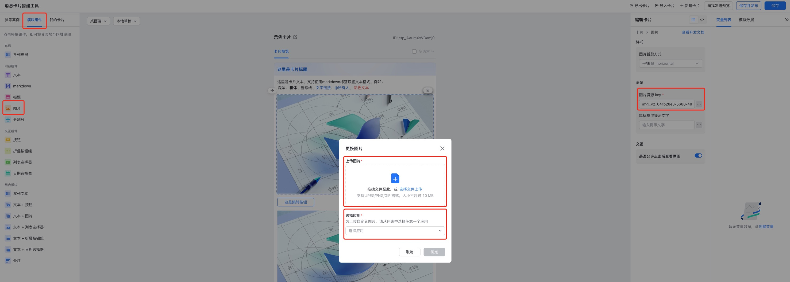

# 飞书 ChatGPT 机器人

[飞书开放平台](https://open.feishu.cn/app)

# 事件订阅

应用详情 -> 开发配置 -> 事件订阅 -> 请求地址配置 : `http://ip:8000/webhook/chatgpt`

应用详情 -> 开发配置 -> 事件订阅 -> 添加事件 : `接收消息 v2.0`

# 权限

应用详情 -> 开发配置 -> 权限管理

```
contact:contact:readonly_as_app

im:chat
im:chat.group_info:readonly
im:chat:readonly

im:message
im:message.group_at_msg
im:message.p2p_msg
im:message.p2p_msg:readonly
```

# 运行

```sh
cp .env.example .env
cp chatbot.json.example chatbot.json
echo {} > db.json

docker-compose up -d --build
```

> 在 [飞书消息卡片搭建工具](https://open.feishu.cn/tool/cardbuilder) 中上传 [loading.gif](./img/loading.gif)，获取到 key 后填入 `.env` 中后可以在机器人回复生成中显示此动图


